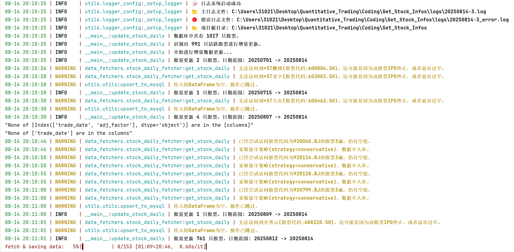

# A股信息访问与存储项目
## A-Share Information Access and Storage Project

## 项目简介

本项目旨在帮助用户通过 Tushare API 轻松访问A股市场数据，并将其存储到 MySQL 数据库中。该项目提供了一个简洁的框架，方便开发者快速集成和扩展A股数据处理功能。目前项目处于初期开发阶段，仅实现了核心功能，后续将逐步完善。

* **25/08/11 ~ 25/08/14更新**： 
  * 现在数据库支持实时更新！只需要运行`src/pipelines/update.py`即可~
  * 新添加了因子的计算与存储，它们在`src/factor_lab`文件夹下面；要运行批量因子计算，请运行`src/pipelines/update_factor.py`
  * 采用了更好的日志记录方式——loguru，现在你可以在logs文件夹下面查看日志


* **Updates on 25/08/11 ~ 25/08/14:**

  * The database now supports real-time updates! Simply run `src/pipelines/update.py` to trigger it.

   * Added calculation and storage of new factors, located in the `src/factor_lab` folder.
   
   * Implemented better logging with loguru—now you can check logs in the `logs` folder.


## 快速上手


本项目使用 Python 3.11，建议使用 Conda 或虚拟环境管理依赖。

1. 创建并激活 Conda 环境：
    ```bash
    conda create -n tushare_3.11 python=3.11
    conda activate tushare_3.11
    ```

2. 安装项目依赖（从 PyPI）：

    `pip install -r requirements.txt`


3. 如果需要 Jupyter Notebook（可选，用于tests文件夹中的jupyter notebook）：

    `conda install notebook`

4. 配置 .env 文件：

    复制 `.env.example` 文件，并重命名为 `.env`。

    在 `.env` 文件中填写以下信息：

   * `TUSHARE_TOKEN`: 您的 Tushare API Token（从 Tushare 官网获取）。
   * `DB_NAME`: MySQL 数据库名称。
   * `DB_PASSWORD`: MySQL 数据库密码。

5. 运行示例：`python src/demo.py`

## 项目现状与未来计划


* **25/08/11 ~ 25/08/14更新**： 
  * 现在数据库支持实时更新！只需要运行`src/pipelines/update.py`即可~
  * 新添加了因子的计算与存储，它们在`src/factor_lab`文件夹下面；要运行批量因子计算，请运行`src/pipelines/update_factor.py`
  * 采用了更好的日志记录方式——loguru，现在你可以在logs文件夹下面查看日志



* **25/08/04 ~ 25/08/08更新**：
  * 项目初步构建，在 `src/demo.py` 中实现了少量函数，用于演示 Tushare API 的调用和 MySQL 数据存储。


* **未来更新**：计划逐步添加更多功能，如数据查询优化、批量处理、数据分析模块等。欢迎贡献代码或提出建议！

## 注意事项

* 确保 Tushare Token 有效，且 MySQL 数据库已正确设置。
* 如果遇到问题，请检查环境变量配置或依赖安装。

如果您有任何反馈或问题，欢迎通过 Issue 提交！


# A-Share Information Access and Storage Project

## Project Introduction

This project aims to help users easily access A-share market data through the Tushare API and store it in a MySQL database. It provides a concise framework for developers to quickly integrate and extend A-share data processing functions. The project is currently in the initial development stage, with only core functions implemented, and will be gradually improved in the future.

## Quick Start

This project uses Python 3.11. It is recommended to use Conda or a virtual environment to manage dependencies.

1. Create and activate the Conda environment:

   ```bash
   conda create -n tushare_3.11 python=3.11
   conda activate tushare_3.11
   ```

2. Install project dependencies (from PyPI):

   `pip install -r requirements.txt`

3. If Jupyter Notebook is needed (optional, for Jupyter notebooks in the tests folder):

   `conda install notebook`

4. Configure the .env file:

   Copy the `.env.example` file and rename it to `.env`.

   Fill in the following information in the `.env` file:

   * `TUSHARE_TOKEN`: Your Tushare API Token (obtained from the Tushare official website).
   * `DB_NAME`: MySQL database name.
   * `DB_PASSWORD`: MySQL database password.

5. Run the example: `python src/demo.py`

## Project Status and Future Plans

* **Updates on 25/08/11 ~ 25/08/14:**

  * The database now supports real-time updates! Simply run `src/pipelines/update.py` to trigger it.

   * Added calculation and storage of new factors, located in the `src/factor_lab` folder.
   
   * Implemented better logging with loguru—now you can check logs in the `logs` folder.

* **Updates on 25/08/04 ~ 25/08/08:**

   * Initial project setup. A few functions were implemented in `src/demo.py` to demonstrate Tushare API calls and MySQL data storage.

**Future Updates:** Planning to gradually add more features, such as query optimization, batch processing, and data analysis modules. Contributions and suggestions are welcome!
## Notes

* Ensure that the Tushare Token is valid and the MySQL database is properly set up.
* If you encounter any issues, please check the environment variable configuration or dependency installation.

If you have any feedback or questions, welcome to submit via Issues!
